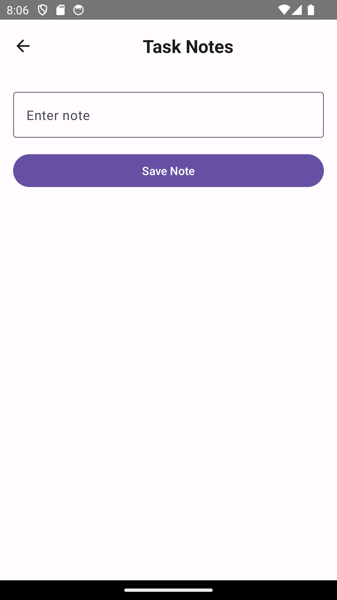

# Notes-Taking App

The app employs **Room** for database management and the **ViewModel** architecture pattern for handling data logic using **Jetpack Compose** to create a functional note-taking application. 
**MainActivity** displays a list of pending tasks with a **Floating Action Button (FAB)** at the bottom, which can be used to navigate to **AddNoteActivity**. In **AddNoteActivity**, there 
is a textbox to take user input for a message and a button to save the notes. These notes appear as a scrollable list of tasks on the **MainActivity** screen by using Jetpack Compose's 
**LazyColumn** (Compose equivalent of RecyclerView). The app uses the **MVVM** (Model-View-ViewModel) architecture, which separates the UI logic from the data handling, ensuring a clean 
and maintainable codebase. **Room** is used as the SQLite object mapping library to manage persistent data. The **AppDatabase** class, defined as a `RoomDatabase`, which provides a singleton 
instance of the database and includes a method to access the **TaskDao** interface, which defines the data access operations. The **TaskEntity** class represents the database entity with 
fields for storing task details. The **TaskViewModel** class manages UI-related data and interacts with the **TaskDao** to perform data operations. It exposes a **StateFlow** of tasks, 
which is observed by the UI components. The **TaskViewModelFactory** class provides instances of **TaskViewModel** with the required **TaskDao** dependency.

**Coroutines** are utilized to perform database operations and data storage tasks asynchronously. The **MainActivity** initializes the **TaskViewModel** and sets up the main content using 
**NavGraph** class, which handles navigation between different screens. The task list is populated using the **TaskList** composable, which observes changes to the tasks via the **TaskViewModel**. 
The **NavGraph** defines the navigation routes between **MainScreen** and **AddNoteScreen**, managing the transition between the task list and the note-taking screen.

## Screenshots

### MainActivity

### AddNoteActivity

